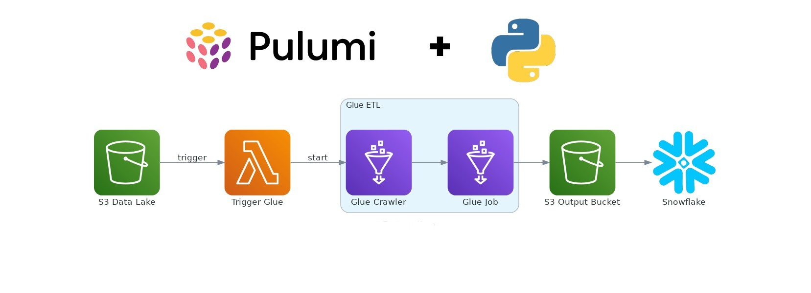
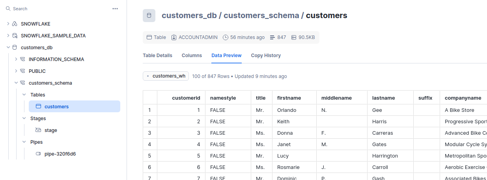

ETL Pipeline with Pulumi, AWS, and Snowflake
======================================================

Overview
--------

This project creates an advanced ETL pipeline using Pulumi for infrastructure as code, leveraging AWS services such as S3, Lambda, and Glue, and integrating with Snowflake for data warehousing. The pipeline automates the ingestion, transformation, and loading of customer data from an S3 data lake into Snowflake.

Architecture
------------
<p align="center">
  
</p>

Prerequisites
-------------

-   Pulumi CLI
-   AWS CLI configured with appropriate permissions
-   Snowflake account with necessary permissions
-   Python 3.8 or later

Project Structure
-----------------

    ├── assets
    │   ├── etl_pipeline.jpg
    │   └── final_snowflake.png
    ├── data
    │   └── customers.csv
    ├── glue
    │   └── glue_job.py
    ├── lambda
    │   ├── __init__.py
    │   ├── lambda_deployment.zip
    │   └── trigger_glue.py
    ├── __main__.py
    ├── modules
    │   ├── glue.py
    │   ├── __init__.py
    │   ├── lambdas.py
    │   ├── __pycache__
    │   ├── s3.py
    │   └── snowflake.py
    ├── Pulumi.dev.yaml
    ├── Pulumi.yaml
    ├── README.md
    └── requirements.txt

Workflow
--------

1.  Data Ingestion:

    -   The initial data is provided as a CSV file named `customers.csv` located in the `data` directory.
    -   When this file is uploaded to the S3 data lake bucket, an S3 event triggers the Lambda function.
2.  Triggering ETL Process:

    -   The Lambda function initiates the Glue crawler and Glue job.
    -   The Glue crawler catalogs the data.
    -   The Glue job transforms the CSV data to JSON format and stores it in the S3 output bucket.
3.  Loading Data to Snowflake:

    -   The transformed data in the S3 output bucket serves as a stage for Snowflake.
    -   Using Snowpipe, the data is automatically loaded into the Snowflake table.


Modules
----------------

### S3 Module (`s3.py`)

Sets up S3 buckets for data lake, output, and scripts.

### Lambda Module (`lambdas.py`)

Manages Lambda functions and IAM roles/policies. Uploads Lambda code.

### Glue Module (`glue.py`)

Sets up Glue database, crawlers, and jobs. Uploads Glue scripts to S3.

### Snowflake Module (`snowflake.py`)

Configures Snowflake resources including warehouses, databases, schemas, tables, and stages. Sets up Snowpipe for automatic data ingestion.

Configuration
-------------

Variables are managed in `Pulumi.dev.yaml`. Ensure the following variables are set:

```yaml
config:
  aws:region: "aws-region"
  aws_account_id: "aws-account-id"
  snowflake_account: "your-snowflake-account"
  snowflake_user: "your-snowflake-user"
  snowflake_password: "your-snowflake-password"
  aws_etl_pipeline:s3_bucket_name: "name-you-want-for-data-lake-bucket"
  aws_etl_pipeline:output_bucket_name: "name-you-want-for-output-bucket"
  aws_etl_pipeline:scripts_bucket_name: "name you want for scripts bucket"
```

Running the Project
-------------------

1.  Install Pulumi and dependencies:

```bash
pulumi plugin install
pip install -r requirements.txt
```

2.  Configure your environment: (only if not yet in the `Pulumi.dev.yaml` file)

```bash
pulumi config set aws:region <aws-region>
pulumi config set aws_account_id <aws-account-id>
pulumi config set snowflake_account <your-snowflake-account>
pulumi config set snowflake_user <your-snowflake-user>
pulumi config set --secret snowflake_password <your-snowflake-password>
pulumi config set aws_etl_pipeline:s3_bucket_name <name-you-want-for-data-lake-bucket>
pulumi config set aws_etl_pipeline:output_bucket_name <name-you-want-for-output-bucket>
pulumi config set aws_etl_pipeline:scripts_bucket_name <name-you-want-for-scripts-bucket>
```

3.  Deploy the infrastructure:

```bash
pulumi up
```

Improvements
------------

-   Remove Hardcoded Bucket Names: Pass the final bucket name as an environment variable to the Lambda function and then to the Glue job.
-   Automate Lambda Deployment ZIP Creation: Automate the process of zipping and uploading Lambda code.
    
Final Data in Snowflake
-----------------------

<p align="center">
  
</p>

Conclusion
----------

This project showcases a powerful ETL pipeline leveraging modern cloud technologies and infrastructure as code practices. The integration of AWS and Snowflake provides a scalable and efficient solution for data ingestion, transformation, and loading.